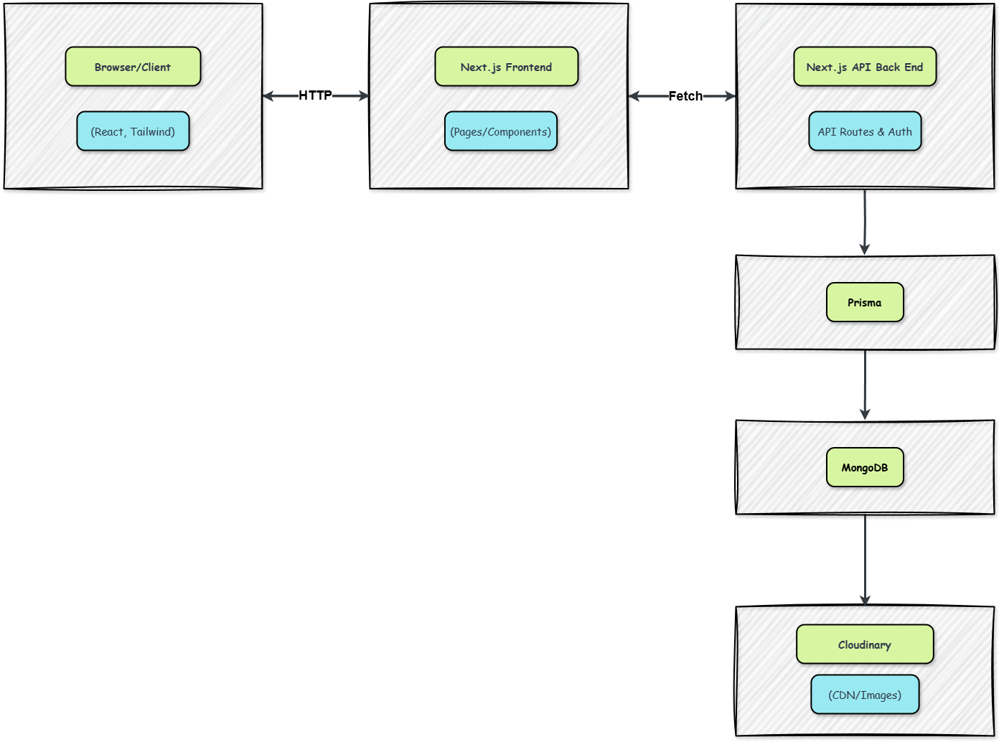

# 🍿 Real-time-Streaming Architecture

## Modern, Scalable, and Developer Friendly

Dex-Real-Time-Streaming is built from the ground up to be robust, maintainable, and a pleasure to work on. The system leverages production-level design patterns and modern tools, drawing clear inspiration from industry leaders but with architecture and features thoughtfully tailored by me to match and learn today’s best practices.

---

## 📑 Table of Contents

- 🔑 [Key Principles](#key-principles)
- 🌿 [System Overview](#system-overview)
- 🚀 [Deployment, Security, and Maintainability](#deployment-security-maintainability)
- 🤔 [Why This Architecture?](#why-this-architecture)

---

### 🔑 Key Principles

| Principles                         | Purpose                                                                                                                                                                                          |
| ---------------------------------- | ------------------------------------------------------------------------------------------------------------------------------------------------------------------------------------------------ |
| **Separation of Concerns**         | Each layer (UI, data, domain, styling) is cleanly separated for clarity and maintainability                                                                                                      |
| **Type Safety Everywhere**         | TypeScript is used across the codebase to catch bugs early and ensure confidence in refactoring                                                                                                  |
| **API-First**                      | Next.js API routes provide all backend logic: authentication, user profile management, movie data, and favorites, while the frontend consumes these endpoints as if from a microservices backend |
| **Optimized Developer Experience** | Rapid feedback via hot-reloading, auto-formatting, and Prisma migrations/scripts makes extending or debugging the project friendly and efficient                                                 |

---

### 🌿 System Overview

## 

**Other flows:**

- Vercel (CI/CD) wraps/builds/hosts Next.js
- Environment variables (secrets) injected everywhere needed

---

- **Frontend**: Built with React (via Next.js) and powered by TypeScript, for a highly interactive, performant user experience. The UI follows top streaming conventions while being uniquely modernized with my own component abstractions and layout optimizations.
- **Styling**: Tailwind CSS enables rapid prototyping and pixel-perfect designs that work across devices, following design tokens and utility-first standards.
- **Server/Backend**: All server logic sits within Next.js API routes, which are stateless and organized by domain (e.g., `/api/movies`, `/api/favorites`). Business logic leverages Prisma for safe and expressive database access.
- **Authentication & Identity**: NextAuth.js is configured for multi-provider auth (GitHub, Google, email/password) and hardened with JWTs and secrets. Sessions are transparent and secure, with custom logic layered in where needed.
- **Database / ORM**: MongoDB (via Prisma) is used for flexible, scalable data storage, chosen for its compatibility with streaming workflows (denormalized user data, fast reads/writes).
- **State Management**: The app uses SWR for efficient, resilient server-state fetching and Zustand for minimal, local UI state (e.g., modals, menu visibility).
- **Forms**: All forms leverage React Hook Form for minimal re-renders, built-in validation, and extensibility.
- **Notifications**: Instant UI feedback (success/error) is delivered through react-hot-toast, to keep users informed without interruption.

---

### 🚀 Deployment, Security, and Maintainability

- **CI/CD**: Deployed through Vercel, enabling serverless scalability, atomic deployments, rollbacks, and preview environments.
- **Code Quality**: Enforced by ESLint, strict TypeScript configuration, and cleanly-typed global definitions.
- **Secrets & Config**: All sensitive credentials are kept in environment variables, following 12-factor app methodology.
- **Performance**: All critical paths are optimized: minimal client bundle, statically typed code, type-safe database queries, memoized selectors, and lazy loading of expensive assets.

---

## 🤔 Why This Architecture?

This is not just a clone, nor is it a loose assembly of tutorials. Every layer is the result of evaluating tradeoffs and focusing on developer happiness, security, scalability, and a premium streaming-user experience.

I understand the architecture end-to-end, and chose each tool or technique specifically for:

- Real-time feedback (SWR, Zustand, toasts)
- Security and privacy (NextAuth with JWT, secret management)
- Speed to market and flexibility (Next.js, Tailwind, Prisma on MongoDB)
- Long-term maintainability (strong typing, modular file structure, API abstraction)

---

For micro-level user-flow, please refer to [flowchart.md](./flowchart.md).

---
