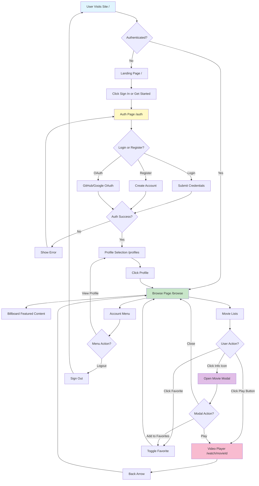

# 🗺️ Feature/User Flowchart

## Micro-level: Seamless User Journey from Sign-in to Streaming

This document visualizes the **step-by-step flow** of a typical user journey in the Dex-Real-Time-Streaming platform.  
It represents how users interact with the product from landing, authentication, profile selection, movie browsing, and playback to account management mirroring the real experience and helping developers/designers optimize for each interaction.

---

### 🔄 User Interaction Flow

---

### 📝 Flow Steps (Text Summary)

- **User Visits Site** (`/`)
- -> **Landing Page** (if not authenticated)
  - -> **Sign In / Register** (`/auth`)
    - If authentication **fails**, show error
    - If successful, continue:
- -> **Profile Selection** (`/profiles`)
- -> **Browse / Discovery** (`/browse`)
  - **Billboard** (Featured content with video preview)
  - **Movie Lists** (Trending Now, My List)
    - Clicking info icon opens **Movie Modal** (InfoModal component)
      - View details
      - Add to Favorites (toggle)
      - Play Movie
    - **Play Movie** ➡️ **Video Player** (`/watch/[movieId]`)
  - **Account Menu** (Navbar dropdown)
    - View Profile
    - **Logout**

---

## 💡 Why This Flowchart?

This flowchart gives the team and newcomers an “at-a-glance” reference of how a user travels through the app. It supports planning for UI/UX, testing, features, and onboarding documentation.

For high-level system architecture, please refer to [architecture.md](./architecture.md).
