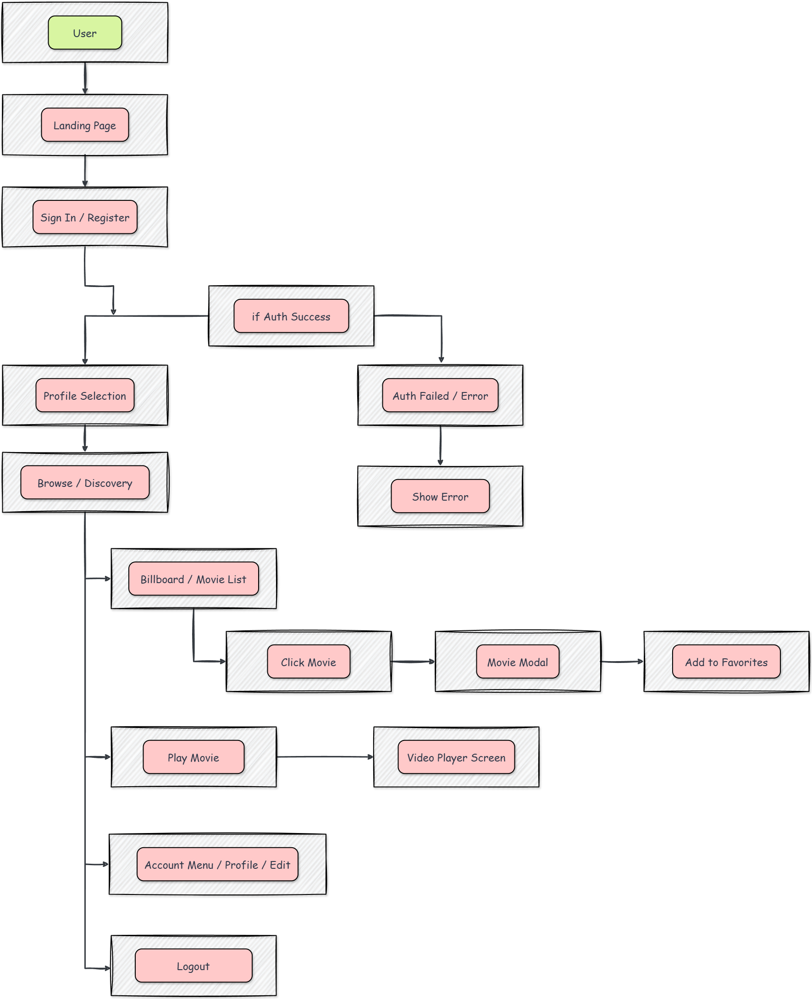

# 🗺️ Feature/User Flowchart

## Micro-level: Seamless User Journey from Sign-in to Streaming

This document visualizes the **step-by-step flow** of a typical user journey in the Dex-Real-Time-Streaming platform.  
It represents how users interact with the product from landing, authentication, profile selection, movie browsing, and playback to account management mirroring the real experience and helping developers/designers optimize for each interaction.

---

## 📊 User Interaction Flow

---

### 📝 Flow Steps (Text Summary)

- **User Visits Site**
- -> **Landing Page**
- -> **Sign In / Register**
- - If authentication **fails**, show error
- - If successful, continue:
  - **Profile Selection**
  - **Browse / Discovery (Movies/Shows)**
    - **Billboard / Movie List**
      - Clicking a movie opens a **Movie Modal**
        - Add to Favorites (optional)
    - **Play Movie** ➡️ **Video Player Screen**
    - **Account Menu / Profile / Edit**
      - **Logout**

---

## 💡 Why This Flowchart?

This flowchart gives the team and newcomers an “at-a-glance” reference of how a user travels through the app. It supports planning for UI/UX, testing, features, and onboarding documentation.

For high-level system architecture, please refer to [architecture.md](./architecture.md).
